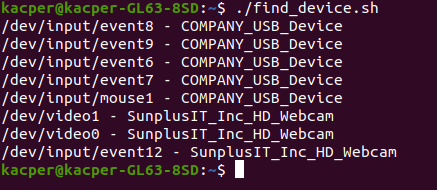

<!-- ## adas_aeb -->
# adas AEB system

## Basic description
Repository containing all of the aeb functionality files
Basically both files achieve same result through different means.

## Requirements
For any executable that uses system files (such as /dev/tty* in this case) it is necessary to have appropriate access. The easiest way to achieve that is through adding user to the dialout group:
```
sudo usermod -aG dialout ${USERNAME}
```

test_lib.cpp requires CppLinuxSerial library to run properly (link: https://github.com/gbmhunter/CppLinuxSerial)

## Usage
Launching from console:
```
g++ ${FILENAME} | ./a.out
```
Or:
```
g++ ${FILENAME} -o ${EXECUTABLENAME} | ./${EXECUTABLENAME}
```

## Additional files
In additions to .cpp files I've also added a small bash scirp, which should be helpful to determine which port is being used by the device (It should be one of the /dev/ttyACM* files in this case, because we are working with a microcontroller). To run it type in console:
```
chmod u+x find_device.sh | ./find_device.sh
```
Mock output:
<p align = "center" >
  
</p>
As we can see there are no devices connected through the serial ports as none of listed items is represented as tty* file
